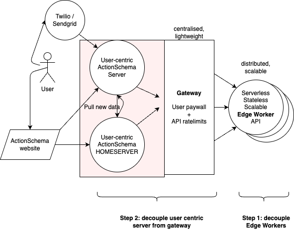

Welcome to the ActionSchema repo! This is the home of the ActionSchema codebase. ActionSchema is an ecosystem of many parts, of which some will be open sourced here: **ActionSchema Utils** and **ActionSchema Server**

**MOTIVATION ActionSchema Utils**:

- Ability to run ActionSchemas serverless (independent of state) e.g. inside of NextJS and also inside any other server with any other way of authorisation, storage, etc.
- Ability to run ActionSchemas against any NoSQL database, e.g. against supabase.
- Ability to run ActionSchemas with your own functions or APIs (e.g. stateless functions in a NextJS api)

**MOTIVATION ActionSchema Server**:

- Ability to keep your data where you trust it, indepdendent of any centralised governing power.
- Ability for power-users to comply with regulations in their country.
- Ability for power-users to create more complex and/or scalable setups
- Ability to get technical feedback (Read: NOT Collaborators per se!)

The provided code does not run yet, since it has all kinds of dependencies which can be found in my bigger codebase, but it's still some work to extract it. At least you can find the core functionality of ActionSchema here. Please note, that although this repo has been made public, it won't be a place with many pull requests and collaboration. It's a read-only deployment that has been bundled in a way that makes collaborating on this difficult. Please contact wijnand@actionschema.com if you wish to collaborate.

# ActionSchema Architecture

In this newly proposed, more decoupled architecture, the following components should have these responsibilities:

**Homeserver**

- Talks incoming api calls from users (via frontends) and providers like twilio (via webhooks)
- Contains all user-state in an user-centric way
- NB: The homeserver can also be done locally!

**Gateway**

- Ensures the user has access
- Ensures the user has enough credit OR has their own api-tokens
- Deducts the credit as specified in response (`priceCredit`)
- Applies universal ratelimits
- Calls the right edge-worker with master secret and required credentials

**Edge worker**

- Verifies master secret
- Logs source of traffic (must be from gateway)
- Executes heavy calculations and accesses third-party APIs (with provided credentials)

# More concretely, this is what I'm working towards:

`wijnand.actionschema.com/openapi.json`

- all fsorm models I've made code for
- my own actionschemas
- some user-state connected plugins (like sending an email)

(ultimately, this will be the actionschema demoserver and self-hosted homeserver solution anyone can host)

`*/api.codefromanywhere.com/openapi.json`

- paywalled AI functions
- different free stateless functions
  (should be serverless hosted)

`api.[domain].com/openapi.json`: legacy apis exposed for different frontend things. ultimately, should be gone.

# TODO NOW:

✅ Ensure the actionschema backend calls all functions via the API, not directly.

✅ Add `getEstimatedPriceCredit` into `executeFunctionWithPaywall` if available.

Ensure `executeFunctionWithPaywall` applies paywall, auth, ratelimit (`makeRatelimitedRequest`) and calls a "direct API" instead of finding function directly. This "direct api" should work with a master secret as well as additional required credentials.

Separate `makeRatelimitedRequest` and getting the credentials from the actual execution of the "direct API" to make it stateless.

At this point, we're making 3 round trips instead of 1 for each request (the server is calling itself 3 times), but we also can separate the server now into a much more scalable solution, making it ready for millions of users!

Create a CLI that deploys all stateless plugins as workers by wrapping them. Seehttps://developers.cloudflare.com/workers/examples/ for examples. Now, all we need to do is provide the right URL for the "direct API".

Limitations in workers:

1. As they're stateless, ratelimits should now be tracked in some global kv-store (unless we use exponential back-off again) or maybe in the same place as where the payments are handled.
2. As we are gatewaying other APIs, we need to put the auth tokens as environment variables instead
3. Things like ffmpeg and other complex things don't always run in workers. There are hard limits on memory and certain clis cannot easily be installed.

# Stay tuned!

Follow, fork, or star this repo, and let me know if you're curious running your own ActionSchema server for whatever reason, email me at wijnand@actionschema.com
