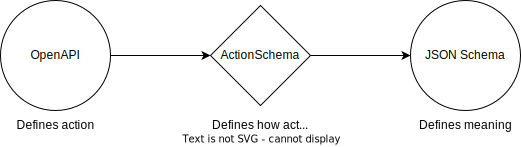

# ActionSchema

ActionSchema intends to be a new standard allowing developers to create data-centric codebases. ActionSchema is a superset of JSON-Schema connecting meaning to how this meaning is obtained through OpenAPIs and code execution.

# Roadmap

⚠️ Rewrite in progress ⚠️

**Goals of the rewrite**:

- Removes layers of complexity: grid-frontend, user-authentication.
- Storage agnostic
- Plugins everywhere (compatible with openapi and jsonschema architecture)
- Keep it simple for a holistic overview (including the OpenAPI spec)
- Runs in browser, serverless, and server environments
- Built-in load balancing
- Built-in staleness detection
- Built-in trusted code-execution

**Maybe**

- Built-in scheduling
- Built-in migration support (moving data around)
- Allows you to use it from VSCode
  - x-plugin selector
  - validator
  - in-data actions

Stay tuned for updates!
